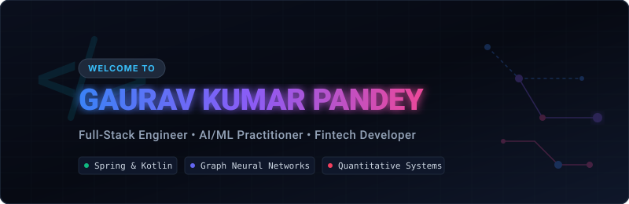

  

   
  
  
  
  

---

### 🚀 About Me

I am a **Full-Stack Software Engineer, Quantitative Developer, and AI Practitioner**. I specialize in building mission-critical concurrent backend systems (Kotlin/Java & Spring Boot), developing production-grade machine learning applications (Graph Neural Networks with PyTorch, autonomous agents, and RAG architectures), and writing highly performant mathematical/financial modeling systems.

---

### 💻 Technologies & Expertise

<table>
  <tr>
    <td valign="top" width="50%">
      <h4>🛠️ Core Languages & Frameworks</h4>
      <ul>
        <li><strong>Languages:</strong> Kotlin, Java, Python, TypeScript, JavaScript, SQL</li>
        <li><strong>Backend Frameworks:</strong> Spring Boot 3.x, Spring WebFlux, FastAPI, Node.js</li>
        <li><strong>Databases:</strong> PostgreSQL, Neo4j, pgvector, H2</li>
        <li><strong>Data Streaming:</strong> Apache Kafka, event-driven pipelines</li>
        <li><strong>Build Tools &amp; Infrastructure:</strong> Gradle, Docker, Kubernetes, AWS (EKS, CloudFront)</li>
      </ul>
    </td>
    <td valign="top" width="50%">
      <h4>🧠 AI/ML, Quant &amp; Systems Security</h4>
      <ul>
        <li><strong>Graph Machine Learning:</strong> PyTorch Geometric, Heterogeneous Graphs (SAGE, GAT, GCN), <code>GNNExplainer</code> (Explainable AI), Louvain community detection</li>
        <li><strong>AI Agents &amp; NLP:</strong> AgentForge (custom multi-agent framework), RAG pipelines, local sentiment heuristics, OpenAI &amp; Gemini APIs</li>
        <li><strong>Quantitative Systems:</strong> Bayesian MCMC simulations (Metropolis-Hastings, Gibbs), options pricing models (Black-Scholes, SV models), delta-neutral hedging</li>
        <li><strong>Systems Security:</strong> E2EE (AES-GCM-256), PBKDF2 local key derivation, zero-knowledge designs, double-entry bookkeeping, API idempotency</li>
        <li><strong>Mobile Security &amp; Reversing:</strong> APK decompilation (Apktool), Smali code mutation, package refactoring, cryptographic signing (Apksigner)</li>
      </ul>
    </td>
  </tr>
</table>

---

### 🌟 Key Showcased Projects

#### 🛡️ [Financial Fraud Detection Using Graph Neural Networks](https://github.com/Alwaysgaurav1/financial-fraud-gnn)
> An enterprise-grade, real-time fraud detection platform modeling financial transactions as a heterogeneous graph, identifying suspicious accounts, and mapping network-level fraud rings.
* **GNN Architecture**: Built PyTorch Geometric SAGE/GAT models on heterogeneous graphs (Customers, Accounts, Devices, IPs) to achieve a **0.962 ROC-AUC** (12% gain over XGBoost tabular baselines).
* **High-Speed Inference**: Designed Kafka + FastAPI stream processors generating predictions with **&lt;45ms P99 latency**.
* **XAI &amp; Louvain Analytics**: Deployed `GNNExplainer` for node/edge importance masks (explaining fraud signals) on a React dashboard, alongside Louvain network projection partitioning for community fraud loop detection.
* *Tech Stack:* PyTorch Geometric, FastAPI, Neo4j, Apache Kafka, PostgreSQL, React.

#### 📈 [MCMC Options Trading &amp; Risk System](https://github.com/Alwaysgaurav1/mcmc-options-trading)
> A high-performance quantitative Bayesian option pricing and delta-neutral risk management system.
* **Bayesian Parameter Inference**: Deployed Metropolis-Hastings and Metropolis-within-Gibbs state-space samplers to model parameter uncertainty from stock returns.
* **Delta-Neutral Arbitrage**: Integrated path-based European/American option pricing simulations over full posterior draws, executing a daily-rebalanced options portfolio backtest hedged with underlying stock.
* *Tech Stack:* Python, FastAPI, NumPy/SciPy, Pandas, Charting (dark-theme glassmorphism dashboard).

#### 🤖 [AgentForge — Enterprise AI Agent Framework](https://github.com/Alwaysgaurav1/agentforge)
> A production-grade, modular framework for orchestrating autonomous agents and multi-agent workflows.
* **State Management**: Built in Kotlin and Spring Boot 3.x supporting WebSockets/SSE messaging, custom tool execution loops, and long-term conversation storage.
* **RAG &amp; Search**: Integrates PostgreSQL + pgvector for semantic search and Retrieval-Augmented Generation context construction.
* *Tech Stack:* Kotlin, Spring Boot 3.x, Spring WebFlux, pgvector, PostgreSQL.

#### ⚡ [High-Concurrency Wallet Ledger System](https://github.com/Alwaysgaurav1/wallet-ledger)
> An enterprise financial bookkeeping ledger designed for high throughput and absolute mathematical reliability.
* **Accounting Architecture**: Implemented rigorous **double-entry bookkeeping** principles ensuring strict transactional ACID compliance across accounts.
* **Concurrency Controls**: Handled heavy load using database-level pessimistic locking, deadlock prevention heuristics, and robust API idempotency layers.
* *Tech Stack:* Kotlin, Spring Boot 3.x, PostgreSQL, H2, Gradle.

#### 🔒 [CovertChat — Disguised E2EE Messenger](https://github.com/Alwaysgaurav1/covert-chat)
> A secure, private messaging app disguised as a standard calculator, using client-side zero-knowledge security.
* **Zero-Knowledge Backend**: Built an E2EE messaging platform with a Python backend storing only encrypted blobs and room hashes, never learning room IDs or contents.
* **Browser Cryptography**: Implemented PBKDF2 local key derivation and AES-GCM-256 Web Crypto API encryption, with a panic lock trigger instantly wiping key memory.
* *Tech Stack:* Python, Web Crypto API, JavaScript (SPA Router), HTML5/CSS3.

#### 📱 [APK Clone &amp; Repackage Engine](https://github.com/Alwaysgaurav1/apk-cloner-toolkit)
> An automated reverse engineering toolkit to decompile, patch, refactor, and cryptographically sign Android APKs to create independent app clones.
* **App Cloning Deployments**: Successfully cloned and executed parallel instances of complex enterprise applications (e.g., **Physics Wallah (PW)** and other high-security platforms) by bypassing anti-cloning layers.
* **Package Name &amp; Manifest Mutation**: Programmed custom scripting engines to recursively rewrite resource references and Package Identifiers (package name renaming) in XML/Smali files, avoiding conflicts on the Android runtime.
* **Smali Bytecode Patching**: Engineered custom hooks injected into decompiled Smali files to bypass client-side verification, API keys checks, and local signature validation routines.
* **Repackaging Pipeline**: Automated assembly using `apktool`, alignment optimization with `zipalign`, and cryptographic signing using `apksigner` with auto-generated test keys.
* *Tech Stack:* Python, Bash, Apktool, Smali, Zipalign, Apksigner.

---

### 📊 GitHub Analytics &amp; Top Languages

  
  

 

  

---

  Designed with 💙 using Google Antigravity

